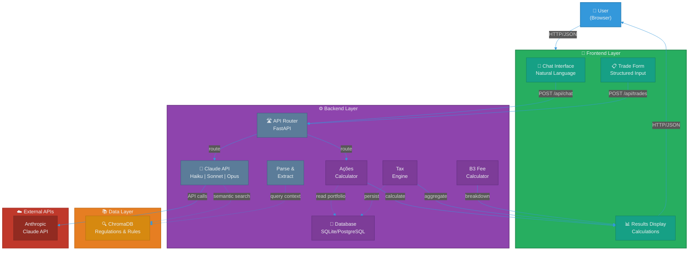
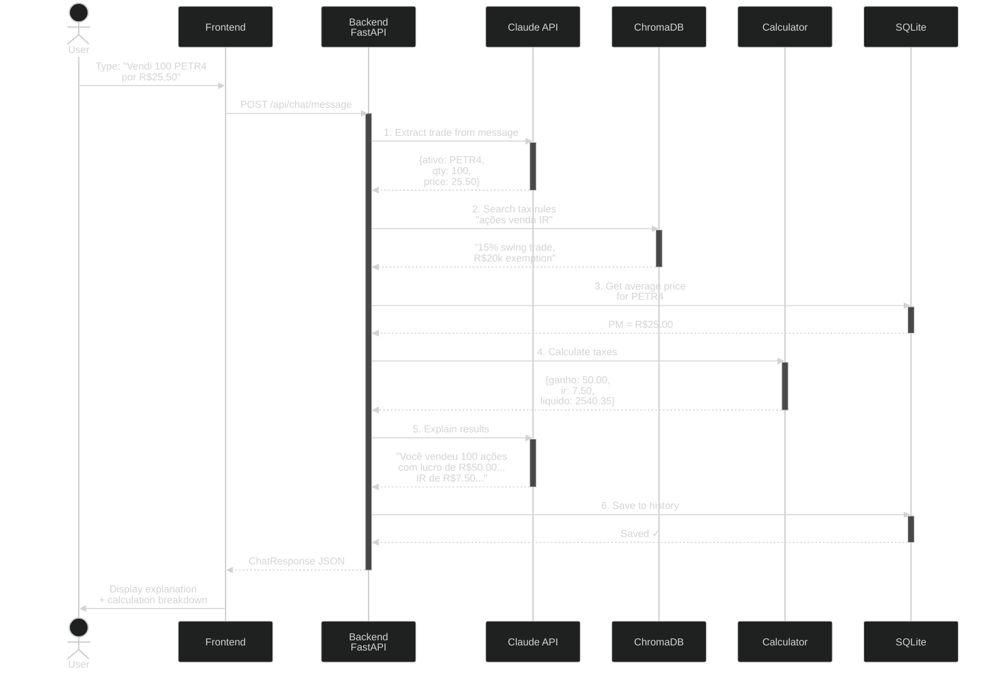
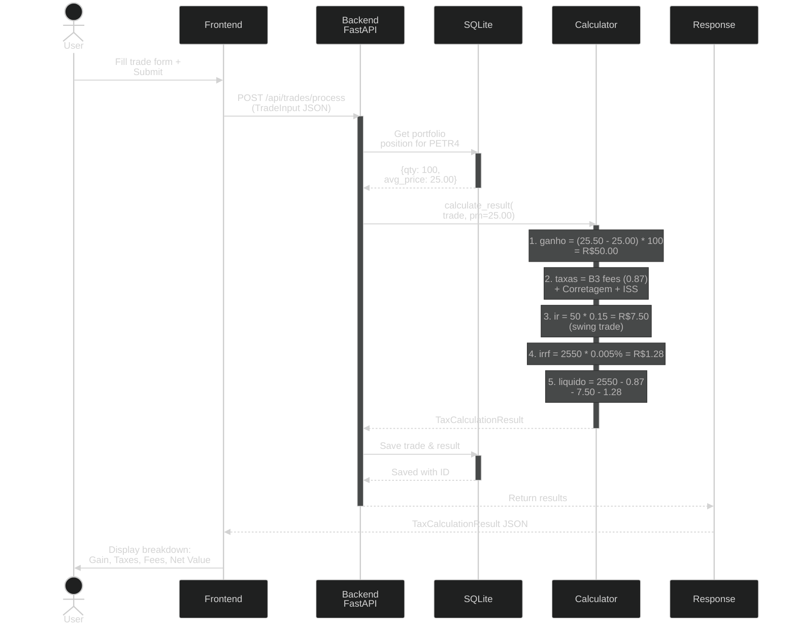
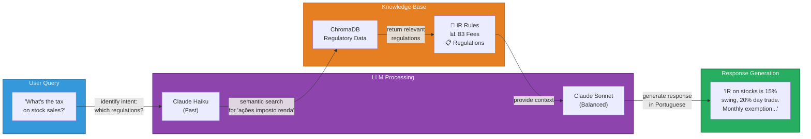
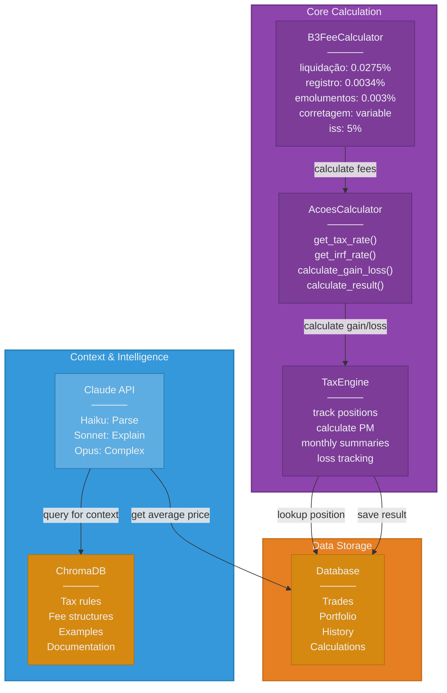
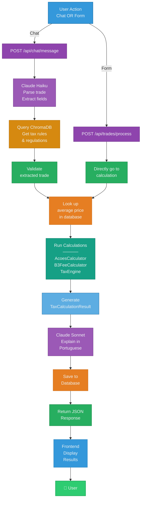
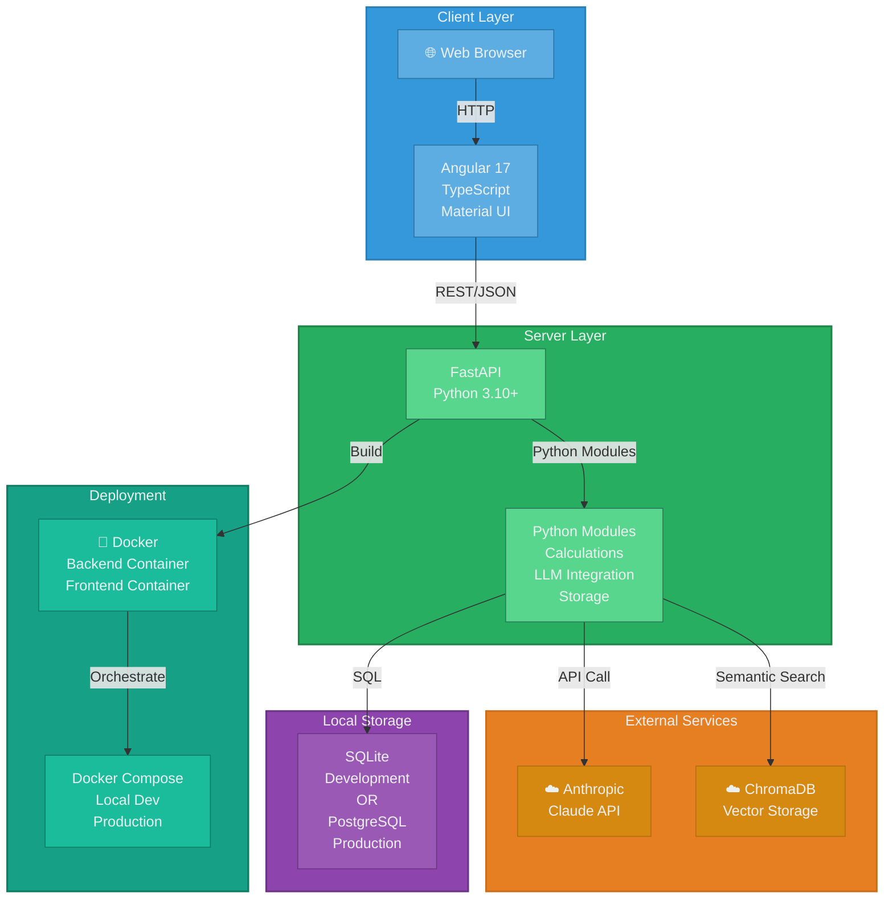
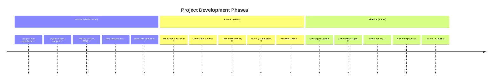
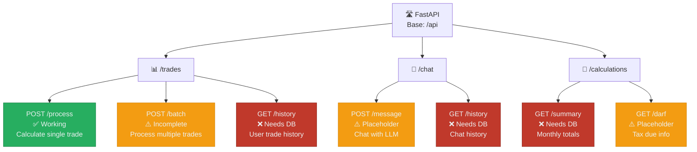
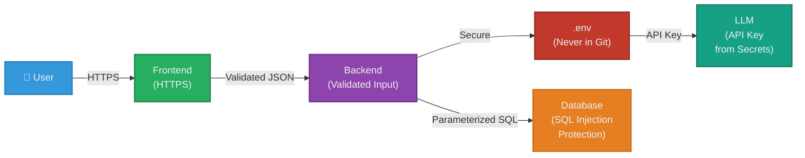

# Brazilian Financial Assistant - System Architecture

## 1. High-Level System Architecture

---

## 2. Chat Workflow (Natural Language Processing)

---

## 3. Structured Trade Processing Workflow

---

## 4. Data Flow: ChromaDB + LLM Integration

---

## 5. Component Interaction Diagram

---

## 6. Complete Request Flow: End-to-End

---

## 7. Technology Stack & Deployment

---

## 8. Phase Rollout

---

## 9. API Endpoint Overview

---

## Key Architectural Principles

| Principle | Implementation |
|-----------|-----------------|
| **Separation of Concerns** | API layer → Calculation layer → Storage layer |
| **LLM as Intelligence** | Haiku (parse), Sonnet (explain), Opus (complex tasks) |
| **Context-Aware** | ChromaDB provides regulatory context to LLM |
| **Type Safety** | Pydantic models for all request/response validation |
| **Modular Calculators** | Each asset type has dedicated calculator (extensible) |
| **Persistent Storage** | Database tracks portfolio for accurate average prices |
| **Stateless API** | Each request is independent; state in database |

---

## Security & Data Protection

